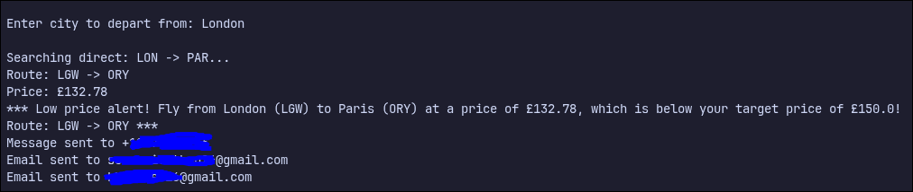
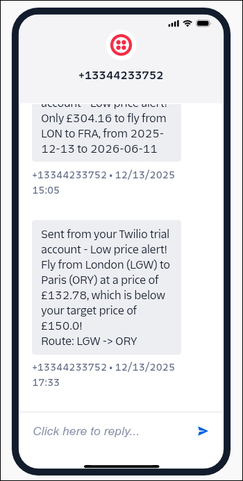

# Capstone Project: Flight Deal Finder

This app searches for the cheapest flights via the [Amadeus for developers API](https://developers.amadeus.com/) and then sends notifications to users via Phone or Email if it finds a price cheaper than the user-defined price.

In this project, I used the `Google Sheets API` instead of the `Sheety API`. This made the project much more harder because the Google Sheets API takes much more time to setup. Eventually, after reading a bunch of documentations and setting up my Google Workspace and Auth, I managed to make it work.

## What I learned and implemented

- Object-Oriented programming by separating classes and functions for the `Amadeus`, `Google Sheet`, and `Notifications`
- Modularization of code (Do not Repeat Yourself (DRY) principles)
- How to read, understand, and correctly implement APIs

## Screenshots

    
 <strong>Screenshot of working app in code</strong>

    
    
 <strong>Receiving notifications in Gmail</strong>

    
    
 <strong>Receiving notifications in Twilio]</strong>

    

