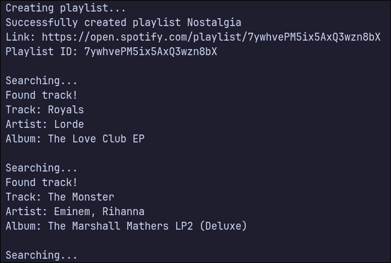
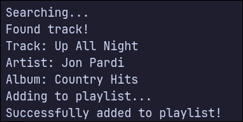
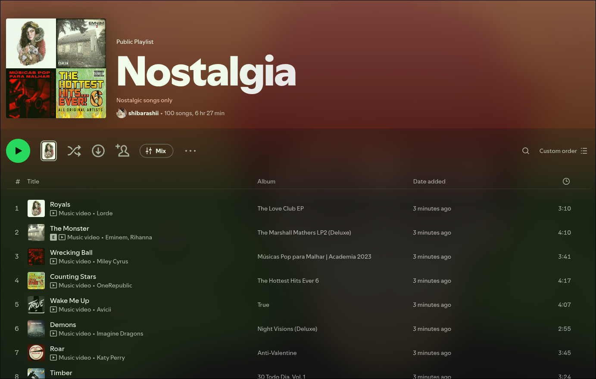

# Musical Time Machine

A musical time machine that lets you search for a date, get the Billboards Hot 100 from that date, and create a playlist of it in your Spotify!

## How I made it

The course requires to use `spotipy` library for ease of use. However, I insisted on using the official `Spotify API`.

Just like using `Google Sheets API` rather than `Sheety` in Day 39-40, using the official `Spotify API` has put my documentation reading, understanding, and implementing skills to test.

In the end, it turned out to work pretty well.

## File Structure

```
├── main.py
├── README.md
├── response.json
├── spotify.py
└── ui.py
```

### `main.py`

The main entry point of the whole logic of the app.

### `spotify.py`

Hosts the `SpotifyClient` class which is responsible for the main functionalities of Spotify such as creating playlists, searching for tracks, and adding tracks to playlists. It composes the class `SpotifyAuth` for the OAuth2 authentication functionalities.

### ui.py

Composes the User Interface to be called in `main.py`. Its main purpose is for abstraction of code and for modularity.

## Screenshots

<div align="left">
    <p> 1. Sample User Prompt</p>
    
    <p> 2. Playlist creation and searching </p>
    
    <p> 3. Successfully added to playlist </p>
    
    <p> 4. Proof working </p>
    
</div>
